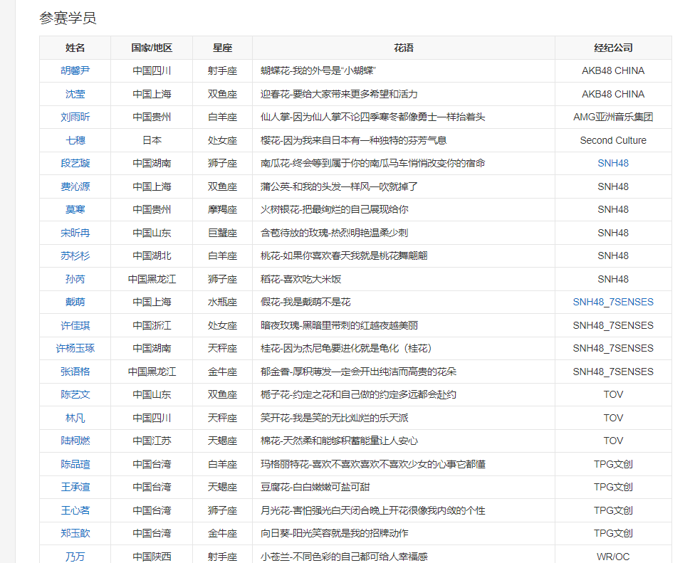

本次项目使用Python来爬取百度百科中《青春有你2》所有参赛选手的信息。

数据来源：https://baike.baidu.com/item/青春有你第二季
 

# 1、深度学习一般过程

收集数据，尤其是有标签、高质量的数据是一件昂贵的工作。

**爬虫**的过程，就是模仿浏览器的行为，往目标站点发送请求，接收服务器的响应数据，提取需要的信息，并进行保存的过程。

**Python**为爬虫的实现提供了工具:requests模块、BeautifulSoup库

### 上网的全过程:

**普通用户:**

打开浏览器 --> 往目标站点发送请求 --> 接收响应数据 --> 渲染到页面上。

**爬虫程序:**

模拟浏览器 --> 往目标站点发送请求 --> 接收响应数据 --> 提取有用的数据 --> 保存到本地/数据库。

**爬虫的过程：**

`   1.发送请求（requests模块）

    2.获取响应数据（服务器返回）

    3.解析并提取数据（BeautifulSoup查找或者re正则）

    4.保存数据
`
### request模块：

requests是python实现的简单易用的HTTP库，官网地址：http://cn.python-requests.org/zh_CN/latest/

requests.get(url)可以发送一个http get请求，返回服务器响应内容。

### BeautifulSoup库：

BeautifulSoup 是一个可以从HTML或XML文件中提取数据的Python库。网址：https://beautifulsoup.readthedocs.io/zh_CN/v4.4.0/

BeautifulSoup支持Python标准库中的HTML解析器,还支持一些第三方的解析器,其中一个是 lxml。

BeautifulSoup(markup, "html.parser")或者BeautifulSoup(markup, "lxml")，推荐使用lxml作为解析器,因为效率更高。

# 2、介绍完了开干吧

环境：

python 3.9

win10 

**python包：**

pip install BeautifulSoup4

pip install requests

pip install lxml